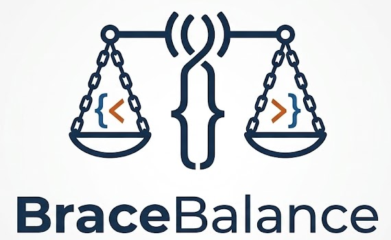
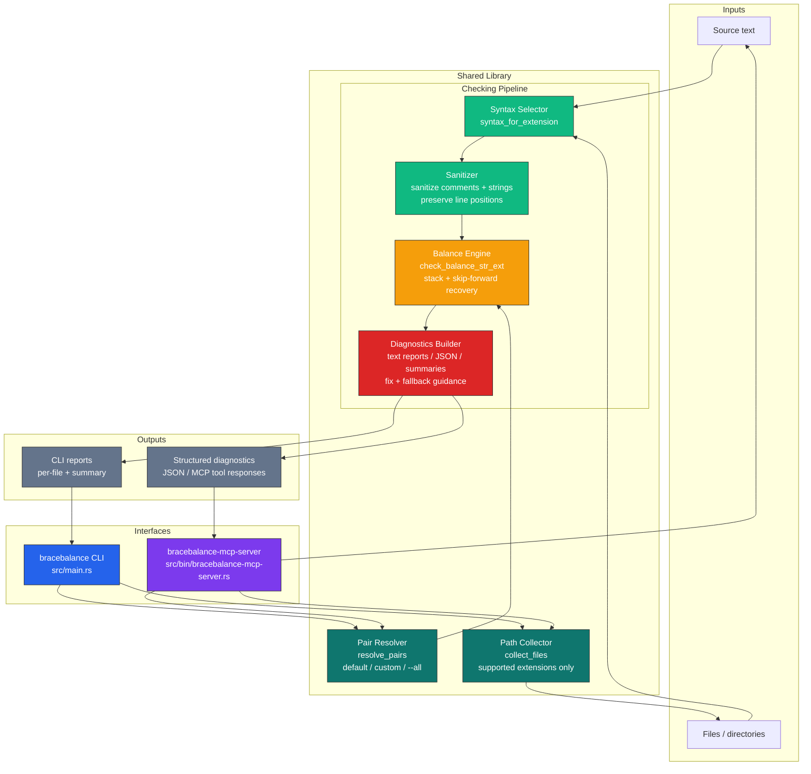

<div align="center">
  
  <br><br>
  <p><strong>Rust + CLI + MCP + source-aware sanitization</strong></p>

  [](https://opensource.org/licenses/MIT)
  [](Cargo.toml)
  [](src/bin/bracebalance-mcp-server.rs)
  [](#how-it-works)
</div>

> *High-signal delimiter balancing for real source files*

# BraceBalance

BraceBalance is a Rust-based delimiter balance checker for source code and code-like files. It strips comments and string literals before scanning, continues through malformed nesting with skip-forward recovery, and produces diagnostics that are useful in editors, CI, and MCP-driven agent workflows.

The core value is straightforward: delimiter checks are only useful when they ignore syntax noise and still produce a readable report after the first structural mistake. BraceBalance is built for that case.

## Why This Exists

Delimiter checkers often fail in two predictable ways:

- they treat braces inside comments and strings as real structure
- they stop being useful after the first mismatch

BraceBalance is built to avoid both. It sanitizes source text first, then uses recovery-oriented scanning so one bad closer does not collapse the rest of the report.

## Why Use It

- A CLI that checks files or recursively scans directories.
- Language-aware sanitization across common source and config formats.
- Recovery-oriented diagnostics for unclosed openers, extra closers, and interleaved nesting.
- Safe append-at-EOF suggestions when they are guaranteed correct.
- Structured JSON and MCP tools for editor and agent integration.

## Checking Flow

```text
Read file or scan directory
        ↓
Sanitize comments and string literals
        ↓
Run stack-based balance check with skip-forward recovery
        ↓
Return focused diagnostics and, when safe, an append fix
```

## Features

- **Reliable Pair Checking**: Detects unclosed openers, extra closers, and interleaved/mismatched nesting across `()`, `{}`, `[]`, and optional `<>`.
- **Language-Aware Sanitizer**: Strips comments and string literals before checking so bracket-like text inside literals/comments does not produce false positives.
- **Actionable Repair Guidance**:
  - Safe append fix when guaranteed (`fix_suggestion`)
  - Manual fallback guidance when append fix is unsafe (`fallback_fix_suggestion`)
- **Noise-Reduced Diagnostics**:
  - Skip-forward mismatch recovery
  - Deduped locations with occurrence counts
  - Prioritized primary locations for triage
  - Concise mode with compaction and suppressed-detail preview
  - Expanded mode with full suppressed trace and ranked hints
- **MCP Server**: First-class tools for `check_text`, `check_path`, and `check_paths` over stdio.
- **Structured Output**: Optional JSON diagnostics for automation and CI pipelines.
- **CI-Friendly Exit Codes**: Returns `0` when all checks pass and `1` when any check fails.

## Supported Languages and File Types

Directory scans recurse into supported source and config files only. Current coverage includes:

| Category | Extensions |
|---|---|
| TypeScript / JavaScript | `ts`, `tsx`, `js`, `jsx`, `mjs`, `cjs` |
| Systems | `rs`, `c`, `cpp`, `cc`, `cxx`, `h`, `hpp`, `hxx` |
| JVM | `java`, `kt`, `kts`, `scala`, `groovy`, `clj`, `cljs`, `cljc` |
| Scripting | `py`, `rb`, `php`, `lua`, `r`, `pl`, `pm` |
| Go / Swift / Dart | `go`, `swift`, `dart` |
| .NET / F# | `cs`, `fs`, `fsi`, `fsx` |
| Functional | `hs`, `ml`, `mli`, `ex`, `exs`, `erl`, `hrl`, `elm` |
| Frontend frameworks | `vue`, `svelte` |
| Shell / PowerShell | `sh`, `bash`, `zsh`, `fish`, `ps1`, `psm1` |
| Data / Query | `sql`, `graphql`, `gql`, `proto` |
| Config / Data | `json`, `jsonc`, `toml`, `yml`, `yaml` |
| Markup | `html`, `htm`, `xml` |
| Stylesheets | `css`, `scss`, `sass`, `less` |
| Infra / Build | `tf`, `hcl`, `cmake`, `dockerfile` |
| Editor / Misc | `vim`, `el` |

The scanner extension list lives in [`src/lib.rs`](/home/npiesco/bracebalance/src/lib.rs#L24). Language-specific sanitization behavior is selected in [`src/sanitize.rs`](/home/npiesco/bracebalance/src/sanitize.rs#L277).

## Architecture

BraceBalance is a shared Rust library with two front doors: a CLI binary for file and directory checks, and an MCP server for editor and agent integrations. Both use the same pair resolution, source-aware sanitization, balance engine, and diagnostics pipeline.



**Legend:**
🟣 Interfaces · 🟢 Sanitization · 🟠 Balance Engine · 🔴 Diagnostics · ⚪ Outputs

The major layers are:

- **Input resolution**: selects delimiter pairs and expands directory paths into supported files.
- **Sanitizer layer**: strips comments and string literals with extension-aware syntax rules before structural checks.
- **Balance engine**: performs stack-based matching with skip-forward recovery, orphaned-opener tracking, and fix-safety checks.
- **Presentation layer**: renders concise or expanded text diagnostics and structured JSON for automation or MCP clients.

## Key Dependencies

| Crate | Purpose |
|---|---|
| [clap](https://crates.io/crates/clap) | CLI argument parsing |
| [rmcp](https://crates.io/crates/rmcp) | MCP server framework/transport |
| [serde](https://crates.io/crates/serde) | Structured diagnostics serialization |
| [serde_json](https://crates.io/crates/serde_json) | JSON diagnostics output |
| [tokio](https://crates.io/crates/tokio) | Async runtime for MCP server |
| [schemars](https://crates.io/crates/schemars) | MCP parameter schema generation |
| [nom](https://crates.io/crates/nom) | Parser primitives used in sanitizer/runtime paths |

## Quick Start

### Prerequisites

- Rust (latest stable)

### Running Locally

```bash
git clone https://github.com/npiesco/bracebalance
cd bracebalance
cargo build --release

# CLI binary
target/release/bracebalance src/

# MCP server binary
target/release/bracebalance-mcp-server
```

### Basic CLI Usage

```bash
# Default pairs: () {} []
bracebalance src/main.rs

# Recursive scan (supported extensions only)
bracebalance src/

# Custom pairs
bracebalance -p "()" -p "[]" script.py

# Include angle brackets
bracebalance --all include/*.hpp
```

### Configuration

Configure pair selection via CLI flags (`clap`):

```bash
# Default pair set
bracebalance src/

# Custom pair set
bracebalance -p "{}" -p "[]" config.json

# Full common set
bracebalance --all src/
```

Configure MCP output behavior per tool call:

- `pairs`: custom list such as `["()", "{}"]`
- `all_pairs`: boolean
- `output`: `"text"` (default) or `"json"`
- `diagnostics_level`: `"concise"` (default) or `"expanded"`

## MCP Integration

### VS Code

Add this to `.vscode/mcp.json`:

```jsonc
{
  "servers": {
    "bracebalance": {
      "type": "stdio",
      "command": "${workspaceFolder}/target/release/bracebalance-mcp-server.exe"
    }
  }
}
```

### Claude Desktop

```json
{
  "mcpServers": {
    "bracebalance": {
      "command": "bracebalance-mcp-server"
    }
  }
}
```

### rmcp Runtime Note

For rmcp 0.16 servers, `.waiting()` is required to keep the process alive:

```rust
#[tokio::main]
async fn main() -> anyhow::Result<()> {
    let server = MyMcpServer::new();
    let transport = rmcp::transport::stdio();
    let service = server.serve(transport).await?;
    service.waiting().await?;
    Ok(())
}
```

Also: avoid writing protocol output to stdout from an MCP stdio server. Use stderr logging (`eprintln!`) for diagnostics.

## Development

### Testing

Run all tests:

```bash
cargo test
```

Fixture coverage in `test_artifacts/` includes deeply nested valid and broken examples across multiple language families, used for both classification and diagnostics quality checks.

### How It Works

The core algorithm is a stack-based delimiter checker with one important twist: it sanitizes source code first, and it uses skip-forward recovery instead of failing on the first mismatch.

The flow is:

1. It optionally strips comments and string literals based on file extension, while preserving line breaks and byte positions, so braces inside `"..."`, comments, heredocs, and similar syntax do not count as structure. This enters through `check_balance_str_ext` in [`src/lib.rs`](/home/npiesco/bracebalance/src/lib.rs#L219), calls `sanitize(...)`, and uses the syntax tables defined in [`src/sanitize.rs`](/home/npiesco/bracebalance/src/sanitize.rs#L276) and described at the top of [`src/sanitize.rs`](/home/npiesco/bracebalance/src/sanitize.rs#L1).
2. It builds two lookup maps from the selected pairs, like `'(' -> ')'` and `')' -> '('`, then scans the sanitized text left to right, line by line. Openers are pushed onto `open_stack` with their line number, original line text, and a sequence number so the tool can later suggest a closing suffix in the right order. See [`src/lib.rs`](/home/npiesco/bracebalance/src/lib.rs#L243) and [`src/lib.rs`](/home/npiesco/bracebalance/src/lib.rs#L277).
3. On a closer, it does not just compare against the top of the stack. It searches backward through the whole stack for the matching opener. If it finds one, everything above that opener is treated as orphaned unclosed and moved into diagnostics, then the matching opener is popped. If it finds nothing, the closer is recorded as a genuine extra closer. This is the skip-forward recovery logic in [`src/lib.rs`](/home/npiesco/bracebalance/src/lib.rs#L312). That is what lets it keep going and produce higher-signal diagnostics instead of cascading nonsense after one bad token.
4. After scanning, it merges the remaining stack entries with those orphaned entries into the final unclosed list, sorts them by line for readability, and decides whether it can safely suggest a fix. It only emits `fix_suggestion` when the problem is simple missing closers at EOF with no orphaning and no extra closers. Otherwise it withholds the auto-fix and gives fallback guidance instead. That logic is in [`src/lib.rs`](/home/npiesco/bracebalance/src/lib.rs#L351) and [`src/lib.rs`](/home/npiesco/bracebalance/src/lib.rs#L393).
5. One subtle design choice: if there are unclosed openers, extra closer messages are suppressed from the main mismatch list and stored separately, so the report focuses on root causes first. See [`src/lib.rs`](/home/npiesco/bracebalance/src/lib.rs#L371).

## Algorithm Flow

```text
Sanitize source text for the detected language
        ↓
Build opener and closer lookup maps
        ↓
Push openers onto stack with source context and sequence
        ↓
On closer, search backward through the stack for a match
        ↓
Drain orphaned openers or record a genuine extra closer
        ↓
Merge remaining stack entries into final unclosed diagnostics
        ↓
Emit an EOF fix only when append safety is guaranteed
```

### Recovery Example

```text
{ [ ) }
```

- When `)` is read, there is no `(` anywhere in the stack, so it is recorded as an extra closer.
- When `}` is read later, it can still match the earlier `{`.
- The `[` that never found a `]` is reported as an unclosed opener instead of causing the scan to derail after the first mismatch.

For a simpler stray closer case:

```text
{ ( ]
```

- When `]` is read, the checker searches for `[` in the stack.
- There is no `[` anywhere in the stack, so `]` is recorded as a genuine extra closer.

This recovery behavior is the reason BraceBalance can keep scanning and still produce useful diagnostics after malformed nesting instead of stopping at the first bad closer.

### Diagnostics Semantics (Safe Fix Contract)

- `fix_suggestion` is emitted only when append-at-EOF is guaranteed safe.
- When append safety cannot be guaranteed, `fallback_fix_suggestion` provides actionable manual steps.
- In concise JSON mode, `unclosed_details` and `extra_closer_details` are arrays (`[]`) rather than `null`.

## License

MIT.

## Contributing

Contributions are welcome. Open an issue or pull request with:

- the expected vs actual behavior,
- a minimal reproduction,
- test evidence (`cargo test` output),
- and MCP/CLI command examples where relevant.
